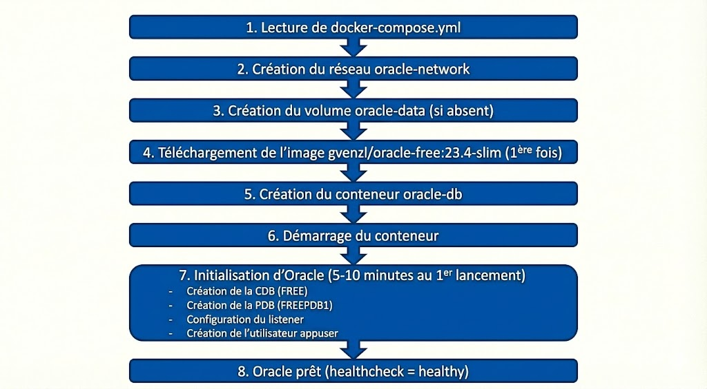

# Lab 02 : Configurer Docker Compose pour Oracle

## Objectifs

À la fin de ce lab, vous serez capable de :

- Comprendre la structure d'un fichier `docker-compose.yml`
- Identifier les paramètres importants pour Oracle
- Modifier les mots de passe et ports si nécessaire
- Comprendre le rôle des volumes

---

## Prérequis

- Docker Desktop installé et fonctionnel (Lab 01)
- Le dossier du projet téléchargé ou cloné

---

## Étape 1 : Naviguer vers le dossier du projet

Ouvrez un terminal et placez-vous dans le dossier du projet :

### Windows (PowerShell)

```powershell
cd C:\Users\VOTRE_NOM\Downloads\oracle-docker-guide
```

### macOS / Linux

```bash
cd ~/Downloads/oracle-docker-guide
```

Vérifiez que le dossier `docker` existe :

```bash
ls docker
```

**Résultat attendu** :

```
docker-compose.yml
```

---

## Étape 2 : Examiner le fichier `docker-compose.yml`

Ouvrez le fichier `docker/docker-compose.yml` avec votre éditeur de texte préféré.

### Contenu complet

```yaml
version: '3.8'

services:
  oracle-db:
    image: gvenzl/oracle-free:23.4-slim
    container_name: oracle-db
    ports:
      - "1521:1521"
      - "5500:5500"
    environment:
      ORACLE_PASSWORD: OraclePass123
      APP_USER: appuser
      APP_USER_PASSWORD: AppUserPass123
    volumes:
      - oracle-data:/opt/oracle/oradata
    restart: unless-stopped
    networks:
      - oracle-network
    deploy:
      resources:
        limits:
          memory: 4G
        reservations:
          memory: 2G
    healthcheck:
      test: ["CMD-SHELL", "healthcheck.sh"]
      interval: 30s
      timeout: 10s
      retries: 5
      start_period: 120s

volumes:
  oracle-data:
    driver: local

networks:
  oracle-network:
    driver: bridge
```

---

## Étape 3 : Comprendre chaque section

### Section 1 : Métadonnées

```yaml
version: '3.8'
```

**Explication** :

- Version du format Docker Compose utilisé
- `3.8` est une version récente et stable
- Pas besoin de modifier

---

### Section 2 : Services

```yaml
services:
  oracle-db:
```

**Explication** :

- Un **service** = un conteneur
- `oracle-db` est le nom du service (arbitraire, vous pouvez le changer)

---

### Section 3 : Image Docker

```yaml
    image: gvenzl/oracle-free:23.4-slim
```

**Explication** :

- **Image source** : `gvenzl/oracle-free`
- **Version** : `23.4-slim` (Oracle 23c, version allégée)
- **Alternatives** :
  - `23.4-full` : version complète (plus lourde)
  - `latest` : dernière version (non recommandé pour la reproductibilité)

**Pourquoi cette image ?**

- Officieuse mais très utilisée et maintenue
- Optimisée pour Docker
- Démarrage plus rapide que l'image officielle Oracle

---

### Section 4 : Nom du conteneur

```yaml
    container_name: oracle-db
```

**Explication** :

- Nom explicite du conteneur (visible avec `docker ps`)
- Facilite l'identification
- Optionnel (Docker génère un nom aléatoire si absent)

---

### Section 5 : Ports exposés

```yaml
    ports:
      - "1521:1521"
      - "5500:5500"
```

**Explication** :

- Format : `"PORT_HOTE:PORT_CONTENEUR"`
- **1521** : Port SQL*Net (connexions client SQL) ← **Obligatoire**
- **5500** : Oracle Enterprise Manager Express (interface web) ← Optionnel

**Schéma** :

```
Votre machine (localhost)     Conteneur
      1521  ──────────────────▶  1521  (Oracle Listener)
      5500  ──────────────────▶  5500  (EM Express)
```

**Modification possible** :
Si le port 1521 est déjà utilisé sur votre machine :

```yaml
    ports:
      - "1522:1521"   # Utilisez 1522 sur l'hôte, 1521 dans le conteneur
```

---

### Section 6 : Variables d'environnement

```yaml
    environment:
      ORACLE_PASSWORD: OraclePass123
      APP_USER: appuser
      APP_USER_PASSWORD: AppUserPass123
```

**Explication** :

| Variable              | Valeur             | Utilisation                                              |
| --------------------- | ------------------ | -------------------------------------------------------- |
| `ORACLE_PASSWORD`   | `OraclePass123`  | Mot de passe pour `SYSTEM` et `SYS`                  |
| `APP_USER`          | `appuser`        | Nom d'un utilisateur applicatif (créé automatiquement) |
| `APP_USER_PASSWORD` | `AppUserPass123` | Mot de passe de `appuser`                              |

> ⚠️ **Sécurité** : Ces mots de passe sont **à usage pédagogique uniquement**. En production, utilisez des mots de passe complexes et sécurisés.

**Modification recommandée (optionnel)** :
Vous pouvez changer les mots de passe :

```yaml
    environment:
      ORACLE_PASSWORD: MonMotDePasse2024!
      APP_USER: etudiant
      APP_USER_PASSWORD: Etudiant123!
```

---

### Section 7 : Volumes (persistance)

```yaml
    volumes:
      - oracle-data:/opt/oracle/oradata
```

**Explication** :

- **Volume nommé** : `oracle-data`
- **Point de montage** : `/opt/oracle/oradata` (dossier des données Oracle dans le conteneur)
- **Rôle** : Persister les données (tables, utilisateurs, etc.) même si le conteneur est supprimé

**Sans volume** :

```
1. Créer une table
2. Arrêter le conteneur
3. Supprimer le conteneur (docker rm)
4. ❌ Données perdues
```

**Avec volume** :

```
1. Créer une table
2. Arrêter le conteneur
3. Supprimer le conteneur
4. Recréer le conteneur
5. ✅ Données toujours présentes
```

---

### Section 8 : Politique de redémarrage

```yaml
    restart: unless-stopped
```

**Explication** :

| Valeur             | Comportement                                 |
| ------------------ | -------------------------------------------- |
| `no`             | Ne jamais redémarrer automatiquement        |
| `always`         | Toujours redémarrer (même au boot de l'OS) |
| `on-failure`     | Redémarrer uniquement en cas d'erreur       |
| `unless-stopped` | Redémarrer sauf si arrêté manuellement    |

**Recommandé** : `unless-stopped` (évite le redémarrage inopiné au boot)

---

### Section 9 : Réseau

```yaml
    networks:
      - oracle-network
```

**Explication** :

- Crée un réseau isolé nommé `oracle-network`
- Utile si vous ajoutez d'autres conteneurs (ex : application web)
- Les conteneurs sur le même réseau peuvent communiquer

---

### Section 10 : Limites de ressources

```yaml
    deploy:
      resources:
        limits:
          memory: 4G
        reservations:
          memory: 2G
```

**Explication** :

- **limits** : Maximum de RAM utilisable (4 Go)
- **reservations** : RAM garantie au démarrage (2 Go)

**Ajustement selon votre machine** :

| RAM totale machine | Recommandation                       |
| ------------------ | ------------------------------------ |
| 8 Go               | `limits: 2G`, `reservations: 1G` |
| 16 Go              | `limits: 4G`, `reservations: 2G` |
| 32 Go+             | `limits: 8G`, `reservations: 4G` |

---

### Section 11 : Health check

```yaml
    healthcheck:
      test: ["CMD-SHELL", "healthcheck.sh"]
      interval: 30s
      timeout: 10s
      retries: 5
      start_period: 120s
```

**Explication** :

- **test** : Commande pour vérifier si Oracle est prêt
- **interval** : Vérification toutes les 30 secondes
- **timeout** : Timeout de 10 secondes par test
- **retries** : 5 tentatives avant de marquer comme "unhealthy"
- **start_period** : Attendre 2 minutes avant de commencer les tests (le temps qu'Oracle démarre)

**Utilité** :

- Docker sait quand Oracle est vraiment prêt
- Visible avec `docker ps` (colonne STATUS)

---

### Section 12 : Définition du volume

```yaml
volumes:
  oracle-data:
    driver: local
```

**Explication** :

- Déclare le volume `oracle-data` comme un volume local
- Docker le crée automatiquement s'il n'existe pas
- Géré par Docker (pas besoin de créer manuellement)

---

### Section 13 : Définition du réseau

```yaml
networks:
  oracle-network:
    driver: bridge
```

**Explication** :

- Crée un réseau de type **bridge** (réseau isolé)
- Les conteneurs peuvent communiquer entre eux via ce réseau

---

## Étape 4 : Modifier le fichier (optionnel)

Si vous souhaitez personnaliser la configuration :

### Changer le mot de passe

```yaml
    environment:
      ORACLE_PASSWORD: VotreMotDePasse123!
```

### Changer le port hôte

```yaml
    ports:
      - "1522:1521"   # Utiliser 1522 au lieu de 1521
```

### Ajuster la RAM

```yaml
    deploy:
      resources:
        limits:
          memory: 2G   # Si vous avez seulement 8 Go de RAM
```

> 💡 **Conseil** : Pour ce TP, gardez les valeurs par défaut sauf si vous avez une contrainte spécifique.

---

## Étape 5 : Valider la syntaxe YAML

Docker Compose peut vérifier la syntaxe sans démarrer les conteneurs.

Dans le dossier contenant `docker/docker-compose.yml`, exécutez :

```bash
cd docker
docker compose config
```

**Résultat attendu** :

- Le fichier YAML retraité et validé s'affiche
- Aucune erreur de syntaxe

**Si erreur** :

```
ERROR: yaml.scanner.ScannerError: ...
```

→ Vérifiez l'indentation (YAML est sensible aux espaces).

---

## Étape 6 : Comprendre le flux de démarrage

Lorsque vous exécuterez `docker compose up` (Lab 03), voici ce qui se passera :




---

## Récapitulatif des paramètres clés

| Paramètre          | Valeur par défaut               | À modifier ?          |
| ------------------- | -------------------------------- | ---------------------- |
| Image               | `gvenzl/oracle-free:23.4-slim` | ❌ Non                 |
| Nom conteneur       | `oracle-db`                    | 🟡 Optionnel           |
| Port SQL            | `1521:1521`                    | 🟡 Si conflit          |
| Port EM Express     | `5500:5500`                    | 🟡 Optionnel           |
| Mot de passe SYSTEM | `OraclePass123`                | 🟡 Recommandé         |
| Volume              | `oracle-data`                  | ❌ Non                 |
| RAM limite          | `4G`                           | 🟡 Selon votre machine |

---

## Checklist de validation

Avant de passer au lab suivant, vérifiez :

- [ ] Vous comprenez le rôle de chaque section du fichier
- [ ] Vous savez modifier les mots de passe et ports
- [ ] Vous comprenez l'utilité du volume
- [ ] `docker compose config` fonctionne sans erreur
- [ ] Vous savez ajuster la RAM selon votre machine

---

## Ce que vous avez appris

- ✅ Structure d'un fichier `docker-compose.yml`
- ✅ Différence entre ports hôte et conteneur
- ✅ Rôle des volumes pour la persistance
- ✅ Variables d'environnement pour configurer Oracle
- ✅ Health checks pour vérifier l'état du conteneur

---

##  Prochaine étape

Le fichier de configuration est prêt !

** [Lab 03 : Démarrer Oracle Database](lab-03-running-oracle.md)**

---

##  Pour aller plus loin

- [Documentation Docker Compose](https://docs.docker.com/compose/compose-file/)
- [Image gvenzl/oracle-free](https://github.com/gvenzl/oci-oracle-free)
- [Oracle Database Architecture](https://docs.oracle.com/en/database/oracle/oracle-database/23/)
